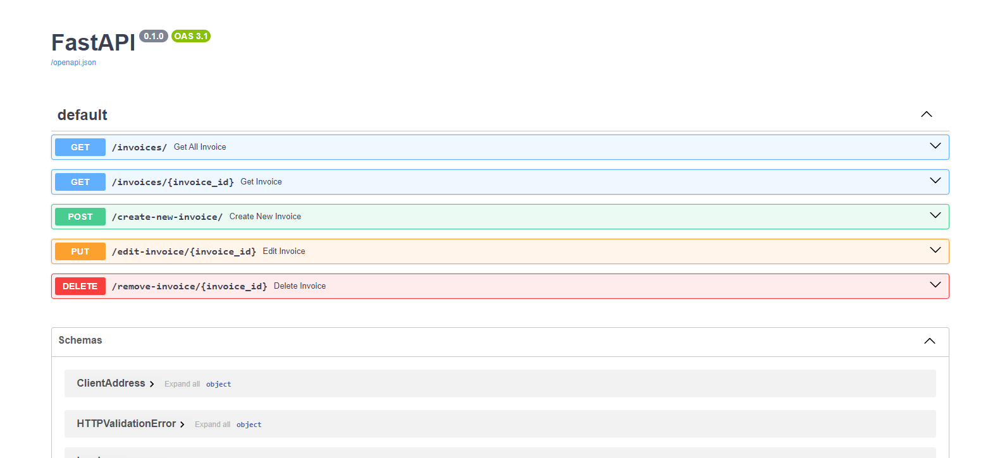

# Invoice App Server

🚧 Please note that the application is currently under development and is only available locally. To run it on your computer, please refer [here](https://github.com/CalcagnoLoic/invoice-app-web?tab=readme-ov-file#launching-frontend-server) for frontend installation. Thank you for your understanding.🚧

<p align="center">
  <a href="https://skillicons.dev">
    
  </a>
</p>

<p align="center">
  
</p>

## Launching backend  `docker compose`

🛑With docker compose, locally, the database is persisted but not made available on github. To access the data in the database, you'll find a file called `data.sql` in the app folder. To use it, start docker compose and connect to the Adminer service. 🛑

To connect to the database service, simply write these environment variables to a file named `.env` at the root of backend folder and in the app folder. These variables is dummy data. During the development phase, these variables will no longer be available.

```
MARIADB_USER=admin@invoice-app
MARIADB_PASSWORD=f*Ap-uidtp
MARIADB_DATABASE=invoice_app
MARIADB_ROOT_PASSWORD=root
```

Then you can run this command:

```cmd
docker compose up
```

️👨‍🔧️ ***WARNING***, it is possible that the backend service crashes on first execution with this message 👨‍🔧

```
️backend-1   | sqlalchemy.exc.OperationalError: (pymysql.err.OperationalError) (2003, "Can't connect to MySQL server on 'database' ([Errno 111] Connection refused)")
```

👨‍🔧If so, just restart the service from docker desktop. 👨‍🔧

Once all services are up and running, go to adminer (http://localhost:8080/) and log in with MARIADB data. On the left, you'll see the “Import” action. All you have to do is select the sql file and your database is ready! 🥳 

## User Stories

Your users should be able to:

- [ ] Create, read, update, and delete invoices <kbd>In Progress</kbd>
- [x] Bonus: Build this project as a full-stack application

## Built with

- Python 3.12 - FastAPI
- Docker 4.30

## Authors

- Personnal website - [Portfolio](https://calcagno-loic.netlify.app/)
- Frontend Mentor - [@CalcagnoLoic](https://www.frontendmentor.io/profile/CalcagnoLoic)
- Linkedin - [LinkedIn](https://www.linkedin.com/in/loic-calcagno/)